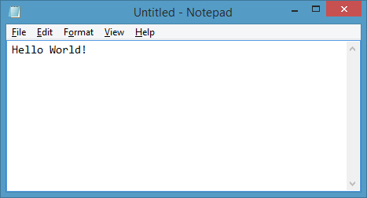

aspnet-hello-world
==================

This sample is broken into multiple steps. The 

# Running the completed sample

Make sure version 0.1-alpha-build-0446 of the K Runtime is installed. See the install instructions at [https://github.com/aspnet/home](https://github.com/aspnet/home).

If you have multiple builds of the runtime installed select version 0.1-alpha-build-0446.

```cmd
kvm use 0.1-alpha-build-0446
```

Use the following commands to download the code and run the sample

```cmd
REM Clone the repository and switch to the project folder
git clone https://github.com/predeekc/aspnet-hello-world.git
cd aspnet-hello-world

REM Download the packages using NuGet
kpm restore

REM start the sample website
k web
```

View the website at [http://localhost:5001](http://localhost:5001).

# Step 1: Basic Handler
```cmd
git checkout Step1
```
### project.json

This file contains the dependencies used by the sample project.  These dependencies will be downloaded when `kpm restore` is run.  The packages will be downloaded using NuGet and placed in **./packages**.

```JSON
{
  "version": "0.1-alpha-build-0446",
  "dependencies": {
    "Microsoft.AspNet.Diagnostics": "0.1-alpha-build-0682",
    "Microsoft.AspNet.Hosting": "0.1-alpha-build-0572",
    "Microsoft.AspNet.Server.WebListener": "0.1-alpha-build-0520",
    "Microsoft.AspNet.StaticFiles": "0.1-alpha-build-0443"    
  },
  "commands": {
    "web": "Microsoft.AspNet.Hosting server=Microsoft.AspNet.Server.WebListener server.urls=http://localhost:5001"    
  },
  "configurations": {
    "net45": {},
    "k10": {}
  }
}
```

### NuGet.Config

Contains ASP.NET vNext NuGet repository entries

```XML
<?xml version="1.0" encoding="utf-8"?>
<configuration>
  <packageSources>
    <add key="AspNetVNext" value="https://www.myget.org/F/aspnetvnext/api/v2/" />
    <add key="NuGet.org" value="https://nuget.org/api/v2/" />
  </packageSources>
  <packageSourceCredentials>
    <AspNetVNext>
      <add key="Username" value="aspnetreadonly" />
      <add key="ClearTextPassword" value="4d8a2d9c-7b80-4162-9978-47e918c9658c" />
    </AspNetVNext>
  </packageSourceCredentials>
</configuration>
```

### Startup.cs

The ASP.NET vNext pipeline is initialized with the **IBuilder** interface. All handlers are a method accepting an **HttpContext** object and expecting a **Task** to be returned.

```C#
public class Startup
{
  public void Configure(IBuilder app)
  {
  }

  // Step 1a: Build a simple handler
  public Task MyHandler(HttpContext context)
  {
      Console.WriteLine("{0} - {1}", context.Request.Method, context.Request.Path.ToString());            
      return context.Response.WriteAsync("<html><head><title>Sample Page</title></head><body>Hello World!<br/></body></html>");
  }
}
```

Registering the handler is done in the **Configure** method using the **Run** method. This will cause this handler to be used for all requests with any URL.

```C#
public void Configure(IBuilder app)
{
    // Step 1b: Use the simple handler
    app.Run(MyHandler);         
}
```
At this point save the file and run the application using `k run`. Once the server is running, navigate to [http://localhost:5001](http://localhost:5001). The page should load. The image load will fail for now.

# Step 2: Middleware

A middleware component is different from a handler since it calls the next item in the pipeline. To do this, the component is provided with the next item in the pipeline when it's constructed. The handler created in the previous step is just a middleware component that doesn't call the next item in the pipeline.

```C#
// Step 2a: Build a simple header injector middleware (before and after)
public class MyPrivateMiddleware
{
  RequestDelegate _next;

  public MyPrivateMiddleware(RequestDelegate next)
  {
    _next = next;
  }

  public async Task Invoke(HttpContext context)
  {
    context.Response.Headers.Set("cache-control", "private, max-age=0, no-cache");

    await _next(context);

    // Do cleanup work here
  }
}
```

The class constructor takes in the **RequestDelegate** that is next in line. The **RequestDelegate** defines the actual handler which takes in the **HttpContext** and returns a **Task**.  In the example above, the class holds the **_next** delegate and the **Invoke** method adds a custom header then calls the next delegate.

```C#
// Step 2b: Build a simple extension wrapper around middleware registration
public static class MyPrivateMiddlewareExtensions
{
  public static void UseMyPrivateMiddleware(this IBuilder app)
  {
    app.Use(next => new MyPrivateMiddleware(next).Invoke);
  }
}
```

Registration of the middle ware component is done using the IBuilder's **Use** method. The **Use** method expects a delegate that takes in the next **RequestDelegate** and returns a **RequestDelegate** for the new middleware. In this case an extension method is used to make the registration easier.  

```C#
public void Configure(IBuilder app)
{
  // Step 2c: Use the middleware
  app.UseMyPrivateMiddleware();

  // Step 1b: Use the simple handler
  app.Run(MyHandler);         
}
```

Finally the new extension method is called to register the middleware.  Run the application using `k run`. Once the server is running, navigate to [http://localhost:5001](http://localhost:5001). The page should load and contain a cache-control header in the HTTP response.

# Step 3: StaticFile Middleware
  - Register the static file handler
  - See that image now loads

# Step 4: Map Middleware
  - Add map section for /private path
  - Move custom middleware into this mapped version only
  - Show that only items in the /private path have the cache response header
  